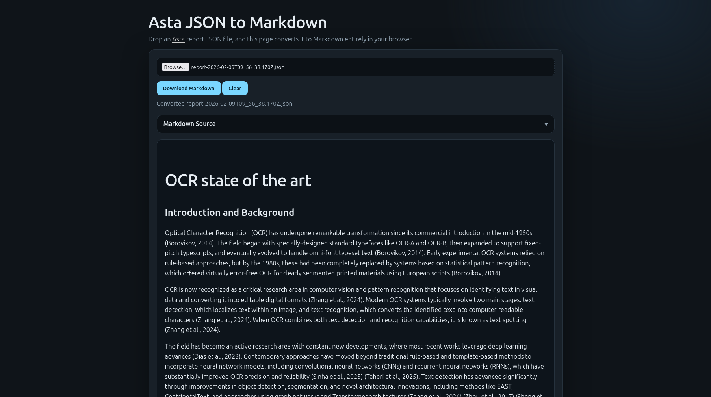

# astajson2markdown

Convert Asta JSON output to a markdown file.

[AllenAI's Asta](https://asta.allen.ai/) report generation tool allows downloads in JSON format. This repository contains two tools:
- a webpage 
- a python script

The webpage can be used as a browser-based reader for Asta JSON files. The python script can be used to convert the JSON file to a Markdown file.

## Usage 
### Python
`python3 convert_report_to_md.py input.json [output.md]`
### HTML
Simply open `index.html` in your browser.

## Features
- Title + Text from all sections
- Converts tables
- Preserves citations
- Sorted list of references
- Download button
